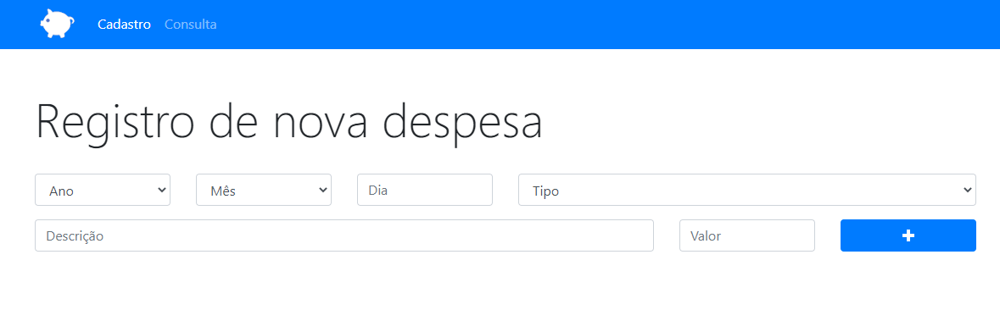
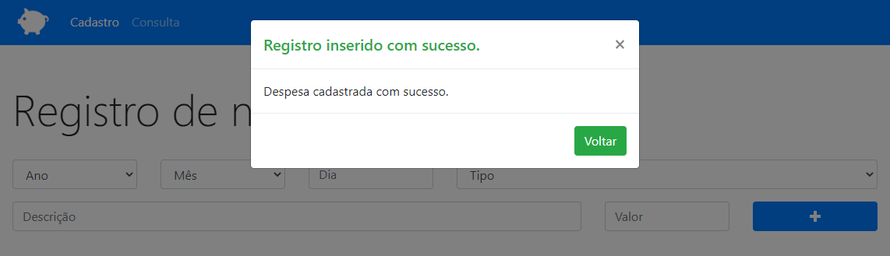

 

# Orçamento Pessoal
O orçamento pessoal é um sistema que permite criar, pesquisar e excluir despesas de determinado dia, ano, mês, tipo ou valor.

<a href="https://5fb68d7b1ea0513fbeae1548--stupefied-lalande-b892e2.netlify.app/">Clique aqui</a> para ver o projeto.

## Índice
* [Tech](#tecnologias)
* [Screenshots](#screenshots)
	

## Tecnologias
- HTML5
- CSS3
- Java Script

## Screenshots

