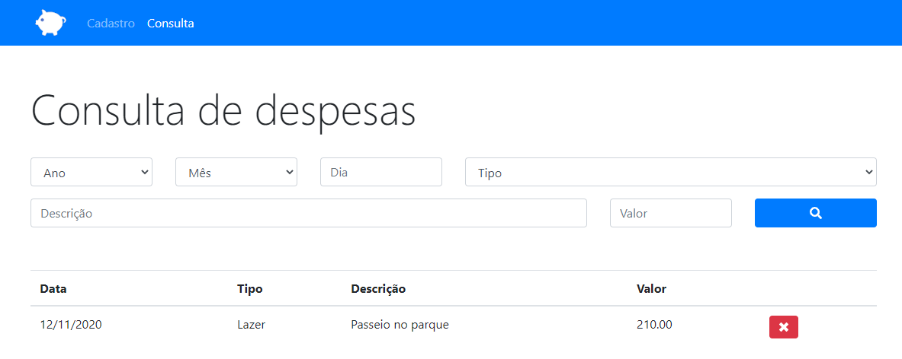

 

# Orçamento Pessoal
O orçamento pessoal é um sistema que permite criar, pesquisar e excluir despesas de determinado dia, ano, mês, tipo ou valor.

## Índice
* [Tech](#tecnologias)
* [Screenshots](#screenshots)
	
## Tecnologias
- HTML5
- CSS3
- Java Script

## Screenshots

